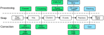

[](https://doi.org/10.5281/zenodo.4580458)

# tpx3HitParser

This software converts raw Timepix3 data (generated by the SPIDR readout) into HDF5 files. It can do clustering, and event
localisation, and a number of corrections. On a decent 60 core workstation the code can parse about 1 Mhit/s data.



The green blocks are performed by tpx3HitParser while the blue blocks are done by [tpx3EventViewer]((https://github.com/M4I-nanoscopy/tpx3EventViewer)). 
The ToT correction file can be generated by [these matlab scripts](https://github.com/M4I-nanoscopy/tpx3-tot-correction). 
The neural network model for event localisation is generated using [these scrips](https://github.com/M4I-nanoscopy/tpx3-event-localisation). 


## Getting ready

### Download

```
git clone https://github.com/M4I-nanoscopy/tpx3HitParser.git
cd tpx3HitParser
```

Recommended way is to use a Python virtualenv, but this is optional.

### Python 3
A minimal version of Python 3.8 is needed (due to use of multiprocessing.shared_memory).

```
python3 -m venv tpx3-py3
source tpx3-py3/bin/activate
pip install pip --upgrade
pip install wheel
```
Install Python dependencies
```
pip install -r requirements.txt
```

### Tensorflow

For CNN event localisation Tensorflow 2.9 is being used. You will need a working 
NVIDIA CUDA installation. With CUDA Toolkit 11.2 and CUDNN 8.1.0. 

### Cluster finding library

For maximum speed in cluster finding, we're making use of a compiled library (written in Rust). Included is a
pre-compiled version of this (Linux/amd64). If Python is unable to load this (i.e. you're on Windows) there is also a Python/numpy version
of this same code. A warning is printed if this version is being used. This version is about 25% slower.

It should be possible to also compile the library for Windows using Rust/Cargo. No special dependencies are being used.
See the code at `clusters/clfind`.

## Running

```
$ ./tpx3HitParser --help
usage: tpx3HitParser.py [-h] [-c FILE] --raw FILE [-C] [-E] -o FILE [--overwrite] [--store_hits]
                        [--store_clusters] [--store_events] [--cluster_stats] [--hits_sort_toa 0/1]
                        [--event_sort_toa 0/1] [--freq_tot] [--cores N] [--max_hits N]
                        [--hits_remove_cross 0/1] [--hits_combine_chips 0/1]
                        [--hits_cross_extra_offset N] [--hits_tot_correct_file FILE]
                        [--hits_toa_phase_correction N] [--hits_tot_threshold N]
                        [--hits_correct_chip_edges 0/1] [--cluster_time_window N]
                        [--cluster_min_size N] [--cluster_max_size N] [--cluster_max_sum_tot N]
                        [--cluster_min_sum_tot N] [--cluster_chunk_size N] [--cluster_matrix_size N]
                        [--event_cnn_model FILE] [--event_cnn_tot_only 0/1]
                        [--event_correct_chip_edges 0/1] [-a A] [-v]

options:
  -h, --help                      show this help message and exit
  -c FILE, --config FILE          Specify other config file (default: None)
  -v, --verbose                   Verbose output (default: False)

input arguments:
  --raw FILE                      Read raw .tpx3 (default: None)

parse arguments:
  -C                              Parse clusters (default: False)
  -E                              Parse events (default: False)

output arguments:
  -o FILE, --output FILE          Output HDF5 file (default: None)
  --overwrite                     Overwrite existing HDF5 file (default: False)
  --store_hits                    Store /hits in output file (default: False)
  --store_clusters                Store /clusters in output file (default: False)
  --store_events                  Store /events in output file (default: False)
  --cluster_stats                 Add the cluster sumToT and nHits to cluster_info or events
                                  (default: False)

post processing:
  --hits_sort_toa 0/1             Sort hit data on ToA (default: None)
  --event_sort_toa 0/1            Sort event data on ToA (default: None)
  --freq_tot                      Parse and store ToT frequency matrix (default: False)

constants:
  --cores N                       Number of cores to use (default: 1)
  --max_hits N                    Maximum number of hits to read (0: infinite) (default: 0)
  --hits_remove_cross 0/1         Remove the middle border pixels between the chips (default: True)
  --hits_combine_chips 0/1        Combine the chips to one matrix (default: True)
  --hits_cross_extra_offset N     Extra offset used for the cross pixels per chip when combining the
                                  chips (default: 2)
  --hits_tot_correct_file FILE    ToT correction file, or 0 for no correction (default: 0)
  --hits_toa_phase_correction N   Apply ToA correction. 0=None, 1=Maastricht-Pll30, 2=Basel-Pll30,
                                  3=Pll94 (default: 0)
  --hits_tot_threshold N          Below this ToT threshold hits are not stored (default: 5)
  --hits_correct_chip_edges 0/1   Correct chip edges for hits (not applied on data used for
                                  clustering) (default: None)
  --cluster_time_window N         Maximum time interval between individual hits to cluster them (in
                                  fine ToA values=1.56ns) (default: 50)
  --cluster_min_size N            Minimum cluster size (default: 2)
  --cluster_max_size N            Maximum cluster size (default: 10)
  --cluster_max_sum_tot N         Maximum cluster sum tot (default: 400)
  --cluster_min_sum_tot N         Minimum cluster sum tot (default: 200)
  --cluster_chunk_size N          Number of hits to consider at once for clustering. (default:
                                  10000)
  --cluster_matrix_size N         Size of the resulting cluster matrix (default: 10)
  --event_cnn_model FILE          CNN model to use for event localisation (default: model-200kv-
                                  tottoa.h5)
  --event_cnn_tot_only 0/1        The specified CNN model uses ToT only (default: False)
  --event_correct_chip_edges 0/1  Correct chip edge for events (default: None)
  -a A, --algorithm A             Event localisation algorithm to use (default: centroid)
```

## Configuration

All options are command line options. Defaults for constants are specified in a separate config file `default.cfg`. You can either
edit this file or make your own and specify this with the `--config` option.

## Citing

[](https://doi.org/10.5281/zenodo.4580458)

Please consider citing either or both the Zenodo deposit of this code and our paper:

* van Schayck, J. Paul. (2020). M4I-nanoscopy/tpx3EventViewer. _Zenodo_. https://doi.org/10.5281/zenodo.3693990
* Schayck, J. P. van, Genderen, E. van, Maddox, E., Roussel, L., Boulanger, H., Fröjdh, E., Abrahams, J.-P., Peters, P. J. & Ravelli, R. B. G. (2020). Sub-pixel electron detection using a convolutional neural network. _Ultramicroscopy_, 218, 113091. https://doi.org/10.1016/j.ultramic.2020.113091
* J Paul van Schayck, Yue Zhang, Kèvin Knoops, Peter J Peters, Raimond B G Ravelli, Integration of an Event-driven Timepix3 Hybrid Pixel Detector into a Cryo-EM Workflow, Microscopy and Microanalysis, Volume 29, Issue 1, February 2023, Pages 352–363, https://doi.org/10.1093/micmic/ozac009


## Copyright

(c) Maastricht University

## License

MIT License

## Authors

* Paul van Schayck (p.vanschayck@maastrichtuniversity.nl)
* Raimond Ravelli (rbg.ravelli@maastrichtuniversity.nl) (corresponding)